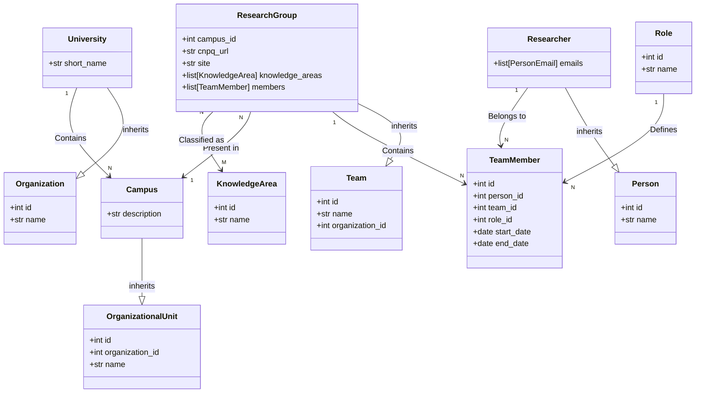
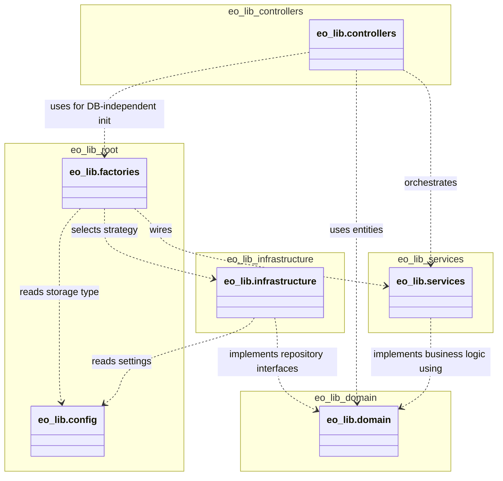
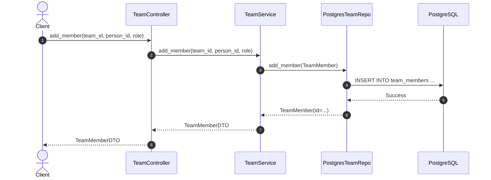

# Software Design Description (SDD)

## 1. Solution Architecture

### 1.1 Architectural Pattern
The system follows a **Strict Layered Architecture** emphasizing separation of concerns, testability, and flexibility. It integrates **MVC (Model-View-Controller)** principles with **Domain-Driven Design (DDD)** tactical patterns.

| Layer | Component | Responsibility |
|-------|-----------|----------------|
| **Presentation** | **Controllers** | Acts as a Facade/Entry Point. Handles user input, delegates to Services, and formats responses (DTOs/Entities). |
| **Business Logic** | **Services** | Encapsulates domain business rules. Orchestrates data flow between Controllers and Repositories. |
| **Data Access** | **Repositories** | Abstracts the storage mechanism. Provides a clean interface for Domain operations (CRUD+L). implemented using the **Generic Repository Pattern**. |
| **Persistence** | **Strategies** | Concrete implementations of storage: `SQLAlchemy`, `JSON File`, or `In-Memory`. Selected via **Strategy Pattern**. |
| **Domain** | **Unified Models** | **DRY Principle**: Entities serve as both Domain Objects and ORM Mappings (SQLAlchemy Declarative). |

### 1.2 Design Patterns
- **Strategy Pattern**: Used to switch between Database, JSON, and Memory storage at runtime via Configuration.
- **Generic Repository**: Defines generic `add`, `get`, `update`, `delete`, `list` operations in an abstract base class to eliminate boilerplate.
- **Factory Pattern**: `ServiceFactory` handles dependency injection, wiring Services with the correct Repository Strategy.
- **Singleton Pattern**: The `PostgresClient` ensures a single global database connection pool.

## 2. Data Design (IEEE 1016)

### 2.1 Mini-World Scenario
The system models a research environment within Universities.
- A **University** (Organization) is the top-level entity.
- A **Campus** (Organizational Unit) is a branch of a University.
- A **Research Group** (Team) is a collective of individuals conducting research, presence in a specific **Campus**.
- A **Researcher** (Person) is an individual belonging to one or more Research Groups.
- A **Knowledge Area** is a thematic classification for research groups.
- A **TeamMember** (Researcher in ResearchGroup) represents the association of a Researcher to a Research Group with a specific **Role**.
- **Leadership** is a specialized membership status defined by the "Leader" role.

### 2.2 Data Dictionary

#### 2.2.1 Researcher (Person)
| Attribute | Type | Constraints | Description |
|-----------|------|-------------|-------------|
| `id` | Integer | PK, Auto-Inc | Unique internal identifier for the researcher. |
| `name` | String | Not Null | The full legal name of the researcher. |
| `identification_id` | String | Unique | Personal identification card / tax ID. |
| `birthday` | Date | Optional | The date of birth. |

#### 2.2.2 PersonEmail
| Attribute | Type | Constraints | Description |
|-----------|------|-------------|-------------|
| `id` | Integer | PK, Auto-Inc | Unique identifier for the email record. |
| `person_id` | Integer | FK (Person) | Reference to the Person owner. |
| `email` | String | Unique, Not Null | The email address. |

#### 2.2.2 Research Group (Team)
| Attribute | Type | Constraints | Description |
|-----------|------|-------------|-------------|
| `id` | Integer | PK, Auto-Inc | Unique internal identifier for the group. |
| `name` | String | Unique, Not Null | The official name of the research group. |
| `description`| Text | Optional | A detailed description. |
| `cnpq_url` | String | Optional | Link to the group in the CNPq Directory of Research Groups. |
| `site` | String | Optional | The group's official website. |

#### 2.2.3 Knowledge Area
| Attribute | Type | Constraints | Description |
|-----------|------|-------------|-------------|
| `id` | Integer | PK, Auto-Inc | Unique identifier. |
| `name` | String | Unique, Not Null | Name of the thematic area (e.g., Computer Science). |

#### 2.2.4 Role (eo_lib)
| Attribute | Type | Constraints | Description |
|-----------|------|-------------|-------------|
| `id` | Integer | PK, Auto-Inc | Unique identifier. |
| `name` | String | Unique, Not Null | Role name (e.g., "Leader", "Researcher"). |
| `description`| Text | Optional | Role description. |

#### 2.2.5 Group Knowledge Area (Association)
| Attribute | Type | Constraints | Description |
|-----------|------|-------------|-------------|
| `group_id`| Integer| FK (ResearchGroup)| Link to the group. |
| `area_id` | Integer| FK (KnowledgeArea) | Link to the area. |

#### 2.2.6 Researcher in Group (TeamMember)
| Attribute | Type | Constraints | Description |
|-----------|------|-------------|-------------|
| `id` | Integer | PK, Auto-Inc | Unique identifier for the membership record. |
| `person_id` | Integer | FK (Person) | Reference to the Researcher. |
| `team_id` | Integer | FK (Team) | Reference to the Research Group. |
| `role_id` | Integer | FK (Role) | Reference to the functional role in the group. |
| `start_date` | Date | Default NOW | Date when the researcher joined the group. |
| `end_date` | Date | Nullable | Date when the researcher left the group. |

#### 2.2.4 InitiativeType
| Attribute | Type | Constraints | Description |
|-----------|------|-------------|-------------|
| `id` | Integer | PK, Auto-Inc | Unique identifier. |
| `name` | String | Unique, Not Null | The type name (e.g., "Research", "Development"). |
| `description` | Text | Optional | Description of the type. |

#### 2.2.5 Initiative
| Attribute | Type | Constraints | Description |
|-----------|------|-------------|-------------|
| `id` | Integer | PK, Auto-Inc | Unique internal identifier for the project. |
| `name` | String | Unique, Not Null | The code name or label of the initiative. |
| `description` | Text | Optional | Detailed description. |
| `start_date` | Date | Optional | Projected start date. |
| `end_date` | Date | Optional | Projected end date. |
| `status` | String | Default "active" | Valid values: active, completed, archived. |
| `initiative_type_id` | Integer | FK (InitiativeType) | The type of the initiative. |

#### 2.2.6 Organization
| Attribute | Type | Constraints | Description |
|-----------|------|-------------|-------------|
| `id` | Integer | PK, Auto-Inc | Unique identifier. |
| `name` | String | Not Null | Entity name. |
| `description` | Text | Optional | - |
| `short_name` | String | Unique, Optional | Acronym or slug. |

#### 2.2.7 OrganizationalUnit
| Attribute | Type | Constraints | Description |
|-----------|------|-------------|-------------|
| `id` | Integer | PK, Auto-Inc | Unique identifier. |
| `name` | String | Not Null | Unit name. |
| `organization_id` | Integer | FK (Organization) | Parent organization. |
| `parent_id` | Integer | FK (Unit), Nullable | Hierarchical parent. |
| `description` | Text | Optional | - |
| `short_name` | String | Optional | - |

#### 2.2.5 Implementation Strategy
The entities are implemented using **SQLAlchemy Declarative Models** inheriting from a shared `Base`. This provides a direct mapping between the classes described above and the underlying Relational Database Schema, ensuring the DRY principle is respected.

## 3. Class Diagrams

### 3.1 Domain Model Class Diagram
This diagram illustrates the core entities and their relationships within the domain layer.

### 3.2 Architecture Class Diagram
This diagram showcases the strict layered architecture, highlighting the flow from Controllers to Services and finally to Repositories.

### 3.3 Package Model Diagram
The following diagram illustrates the dependencies between the logical packages (folders) of the library. It clearly shows the **One-Way Dependency Rule**: Outer layers depend on inner layers, and the Domain remains the independent core.

## 4. Sequence Diagram: Add Member to Team

